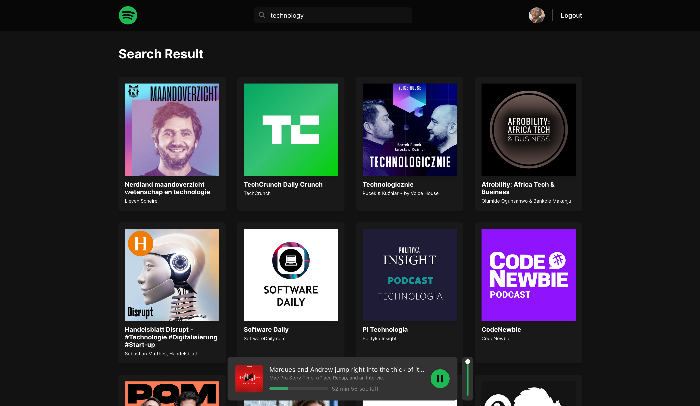
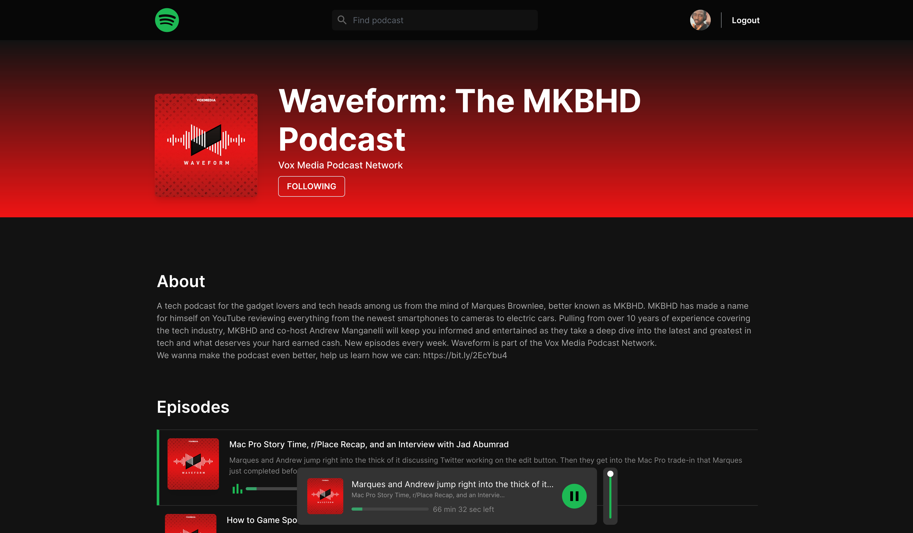

# Spoticast

> A standalone spotify podcast webapp 

Built with the following:

- [Spotify Web API](https://developer.spotify.com/documentation/web-api/)
- [Create React App](https://github.com/facebook/create-react-app)
- [Express](https://expressjs.com/)
- [Reach Router](https://reach.tech/router)
- [ChakraUI](https://chakra-ui.com/)

## Setup

1. [Register a Spotify App](https://developer.spotify.com/dashboard/applications) and add `http://localhost:8888/api/v1/callback` as a Redirect URI in the app settings
1. Create an `.env` file in the root of the project based on `.env.example`
1. `yarn && yarn client:install`
1. `yarn dev`

## Screenshots

